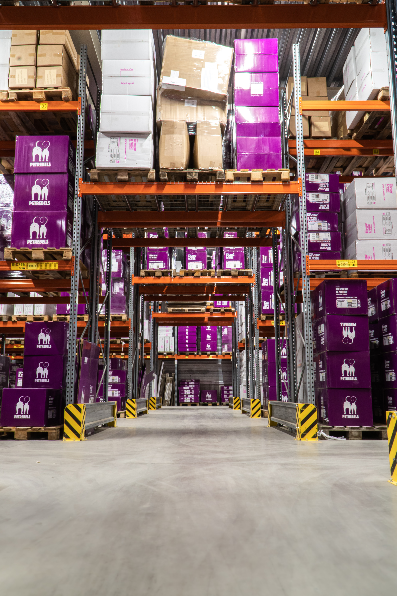

# Inventory-Analysis

## Introduction
This is power bi project of an inventory analysis of a manufacturing company which focuses on the production details of different products spaning from 2008-2013. The main focus is to generate insights of scraped and stocked products.

**_Disclaimer_**: tHis is no company's data that i know of, it's an assignment from Powerbi saturday hosted by David Abu and Oyinbooke

## Problem Statement
1. To analyse products and years with the highest waste
2. Do a comparative analysis between scrapped and stocked products
3. Compare the pecentage of scraped products from total cost incured in production.

## Skills
The following features were incoporated
1. Power Query
2. Modelling
3. Dax(converted text to integers)
4. Built Slicers

## modelling
Power bi automatically adjusted the model for which suiys me perfectly, so i didn't see the need to adjust my model.

